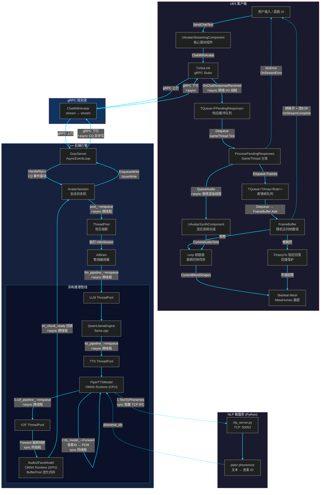

# 基于大模型与多模态推理的虚拟人流式驱动引擎

[](https://github.com/WiloMyst/VHSystem/blob/master/LICENSE) [](https://github.com/WiloMyst/VHSystem)


## 概述

本项目为面向实时交互场景的**端云协同虚拟人流式驱动引擎**。系统采用 C++ 微服务后端与 Unreal Engine 5 (UE5) 客户端解耦架构，构建了涵盖大模型 (LLM) 流式生成、TTS 语音合成与端侧 3D MetaHuman 面部表情驱动的异构推理流水线。

项目旨在通过 gRPC 全双工通信、基于 RAII 的内存池与端侧抗抖动机制，解决虚拟人交互方案中的网络 I/O 阻塞、内存碎片化，以及网络抖动引发的音画时序偏移问题，提供高吞吐、低延迟的交互方案。


## 系统架构



### 数据流概要

```
用户文本 → gRPC 上行 → AvatarSession → AIBrain 管线编排
    → [1] LLM (llama.cpp) 流式生成 + 标点断句
    → [2] NLP 微服务 (piper-phonemize) 文本→音素ID
    → [3] TTS (ONNX/CPU) 音素ID→PCM音频
    → [4] V2F (ONNX/GPU) PCM音频→52维BlendShape帧
    → gRPC 下行分块 → 客户端 TQueue 缓冲
    → USynthComponent 音频播放 + Lerp 帧插值 → MetaHuman 面部驱动
```


## 演示

[Image01](assets/Image01.jpg)

[Video01](assets/Video01.mp4)


## 功能列表

### 服务端 (C++ Backend)

- **基于 gRPC 的异步双向流通信底座:**
  - **全双工流式调度：** 采用 gRPC 异步双向流替代传统的 Request-Response 阻塞模型。实现文本输入的流式接收与 PCM 音频 / BlendShape 表情权重的分块实时下发，最大化降低首段音频响应时间 (TTFA)。

  - **背压熔断与并发控制：** 实现网络 I/O 与 AI 推理任务的物理线程解耦。构建具备背压机制的自定义 C++ 线程池，基于任务队列阈值 (`max_queue_size`) 动态触发请求熔断与优雅降级，保障系统在高并发穿透下的资源可用性，规避 OOM 风险。

- **异构推理管线与池化内存架构:**
  - **RAII 高性能内存池：** 针对高频视音频 Tensor 数据流，构建基于 RAII 范式的自定义内存池 (`BufferPool`)。结合智能指针删除器管理内存块生命周期，通过预分配与池化复用大幅减少推理关键路径上的动态堆分配开销。
  - **端到端数据流转优化：** 级联 `llama.cpp` 与 ONNX Runtime C++ API。通过多级生产者-消费者并发模型，在主机侧将 Piper TTS 输出的音频波形经内存池缓冲后直接作为 V2F 模型的输入 Tensor，减少中间数据拷贝开销，保障异构推理流水线的高效衔接。

- **NLP 音素映射微服务:**
  - 独立 Python 进程 (`nlp_server.py`)，基于 `piper-phonemize` 执行文本至音素 ID 的映射，通过 TCP 持久化连接与 C++ 后端进行 IPC 通信，将 CPU 密集型的分词注音任务与主推理循环物理隔离。


### 客户端 (UE5 Frontend)

- **时序同步与抗抖动渲染管线:**
  - **跨线程安全数据分发：** 依托 UE 核心无锁容器 `TQueue` 构建数据消费队列，接收网络层下发的碎片化音频流与表情序列，实现网络 I/O 线程与 `GameThread` 渲染主线程的有效隔离，规避高频通信下的竞态条件。
  - **现代流式音频合成与帧率补偿：** 引入 UE 现代 `USynthComponent` 。通过底层音频渲染线程按需消费 PCM 队列，规避了硬编码生命周期带来的截断隐患。同时以实际音频消耗时间为参考时钟，对云端下发的离散 30FPS 表情权重通过 `Lerp` 机制进行线性插值，平滑网络抖动带来的时序误差。
  - **数据饥饿与状态回落机制：** 针对网络拥塞导致的数据饥饿场景，引入基于 `FInterpTo` 的阻尼干预策略。当本地缓冲区耗尽时，驱动面部权重以受控速率平滑回退至中性状态，防止渲染管线出现状态突变或网格撕裂。
- **模块化集成与事件驱动架构:**
  - **网络生命周期与逻辑解耦：** 依托 TurboLink 插件生成 UE 端 gRPC 存根 (Stubs)，将 RPC 会话生命周期与表现层核心驱动组件 `UAvatarStreamingComponent` 进行边界隔离，提升模块的可测试性与复用度。
  - **泛用型组件化封装：** 遵循高内聚低耦合原则，构建基于多播委托的状态流转体系（如 `OnStreamComplete`、`OnStreamError`）。通过严格校验网络 EOF 与本地缓冲消耗状态触发事件回调，驱动 UI 蓝图层进行状态响应。实现了底层 C++ 驱动逻辑与前端交互/美术表现的解耦，支持将组件低侵入式挂载至任意标准 Skeletal Mesh 资产。


## 版本

- **前端引擎：** Unreal Engine 5.7
- **后端编译：** CMake 3.15+, GCC/Clang (C++17)
- **系统环境：** Linux (Ubuntu 22.04 LTS) / Windows (WSL2)
- **核心依赖：** ONNX Runtime 1.24+, gRPC 1.50+, Python 3.8+ (NLP 微服务)


## 快速开始

### 1. 服务端 (C++ Backend)

```bash
cd VHServer

# 编译 C++ 后端
mkdir -p build && cd build
cmake .. && make -j$(nproc)

# 准备 NLP 微服务 Python 环境
cd ..
python3 -m venv .venv
source .venv/bin/activate
pip install piper-phonemize

# 启动 NLP 音素映射微服务
python nlp_server.py &

# 启动 C++ 后端引擎
./start_server.sh
```

### 2. 客户端 (UE5 Frontend)

1. 使用 UE 5.7 打开 `VHClient/AvatarClient.uproject`
2. 确保已启用项目插件：`AppleARKitFaceSupport`、`LiveLink`
3. 编译并运行项目


## 资源

**Plugins & Libraries:**

- [grpc/grpc](https://github.com/grpc/grpc) - 核心 RPC 框架
- [microsoft/onnxruntime](https://github.com/microsoft/onnxruntime) - 异构推理引擎
- [thejinchao/turbolink](https://github.com/thejinchao/turbolink) - UE5 gRPC 快速集成插件
- [gabime/spdlog](https://github.com/gabime/spdlog) - 后端高性能异步日志
- [jbeder/yaml-cpp](https://github.com/jbeder/yaml-cpp) - 配置文件解析
- [ggml-org/llama.cpp](https://github.com/ggml-org/llama.cpp) - 轻量级大模型推理引擎
- [nlohmann/json](https://github.com/nlohmann/json) - 现代 C++ JSON 库

**Models:**

- [rhasspy/piper](https://github.com/rhasspy/piper) - 轻量级且极速的 VITS TTS 引擎
- [rhasspy/piper-phonemize](https://github.com/rhasspy/piper-phonemize) - 文本音素化引擎 (NLP 微服务核心依赖)
- Qwen2.5-1.5B - 通义千问15亿参数版

